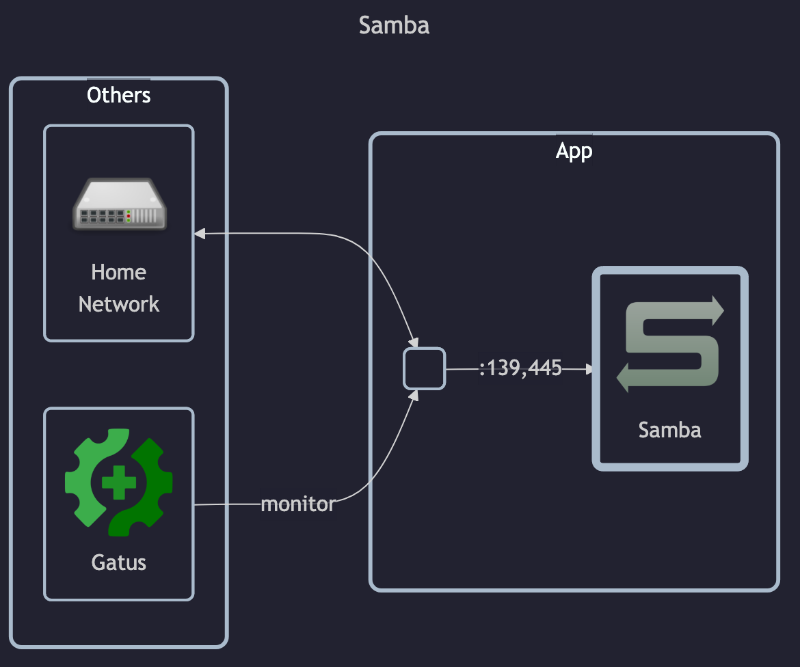

# SMB

## Docs

- Samba setup tutorial: `https://wiki.samba.org/index.php/Setting_up_Samba_as_a_Standalone_Server` (error 500)
- `smb.conf` manpage: <https://www.samba.org/samba/docs/current/man-html/smb.conf.5.html>

Prometheus exporter:

- GitHub: <https://github.com/imker25/samba_exporter/tree/main>

## Before initial installation

- Follow general [guide](../../docs/Checklist%20for%20new%20docker-apps.md)

## After initial installation

Empty
