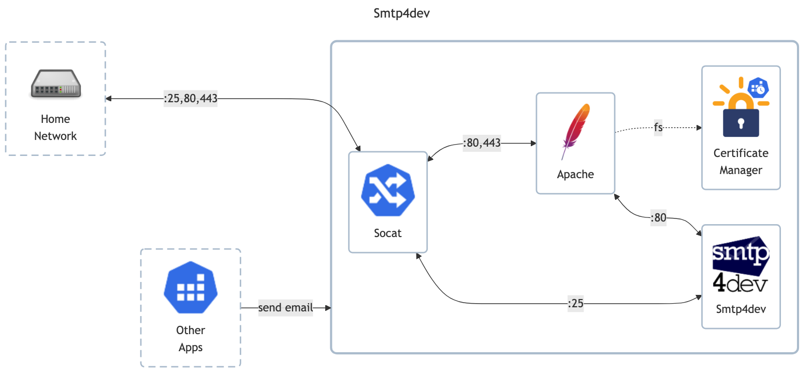

# Smtp4Dev

> Local smtp server for development

## Docs

- Docs: <https://mailosaur.com/blog/a-guide-to-smtp4dev>
    - Installation <https://github.com/rnwood/smtp4dev/wiki/Installation>
    - Configuration: <https://github.com/rnwood/smtp4dev/wiki/Configuration>
- GitHub: <https://github.com/rnwood/smtp4dev>
- DockerHub: <https://hub.docker.com/r/rnwood/smtp4dev>

## Before initial installation

- Follow general [guide](../../docs/Checklist%20for%20new%20docker-apps.md)

## After initial installation

Empty
