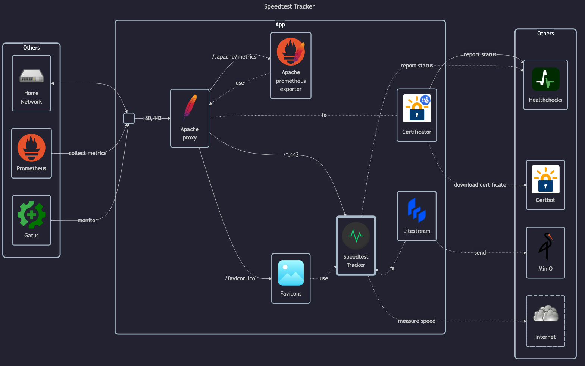

# SpeedTest Tracker

## Docs

Speedtest Tracker (official):

- Main page: <https://speedtest-tracker.dev>
- Docs: <https://docs.speedtest-tracker.dev>
- GitHub: <https://github.com/alexjustesen/speedtest-tracker>

LinuxServer (unofficial):

- LinuxServer docs: <https://docs.linuxserver.io/images/docker-speedtest-tracker>
- LinuxServer GitHub: <https://github.com/linuxserver/docker-speedtest-tracker>
- LinuxServer DockerHub: <https://hub.docker.com/r/linuxserver/speedtest-tracker>

## Before initial installation

- Follow general [guide](../../docs/Checklist%20for%20new%20docker-apps.md)

## After initial installation

- Setup speed tresholds
- Add (always) webhook to healthchecks
    - `https://healthchecks.matejhome.com/ping/<ping-key>/speedtesttracker-app`
- Add (treshold) webhook to ntfy / gotify / smtp notifications:
    - `https://ntfy.matejhome.com`, topic: `speedtesttracker`, username: `publisher`, password: `<password>`
    - `https://gotify.matejhome.com/message?token=<token>`
    - `speedtesttracker@matejhome.com`
- Add readonly API token for other services and save in Vaultwarden
