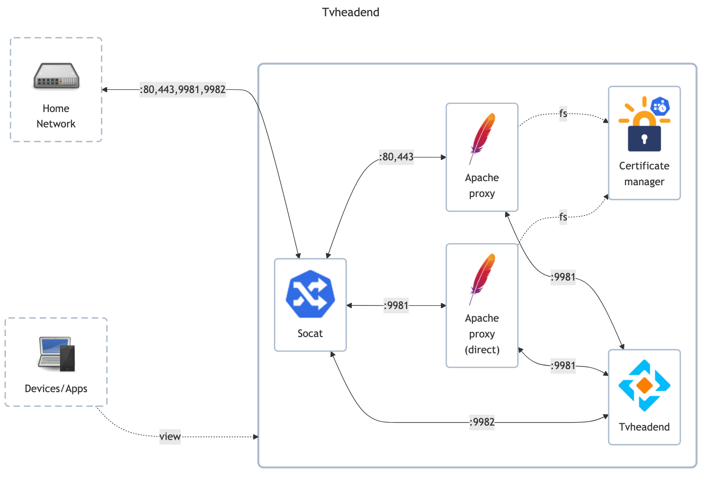

# Tvheadend

## Docs

Tvheadend (official):

- Official docs: <https://docs.tvheadend.org/documentation>
- Official repository: <https://github.com/tvheadend/tvheadend>

LinuxServer (unofficial):

- LinuxServer docs: <https://docs.linuxserver.io/images/docker-tvheadend>
- LinuxServer GitHub: <https://github.com/linuxserver/docker-tvheadend>
- LinuxServer DockerHub: <https://hub.docker.com/r/linuxserver/tvheadend>

## Before initial installation

- Follow general [guide](../../docs/Checklist%20for%20new%20docker-apps.md)

## After initial installation

- Setup users `matej` (admin), `homelab-stream`, `homelab-test`
- Setup anonymous user, in order to allow jellyfin to load channel logos, accordingly:
    - 
- Setup channels
