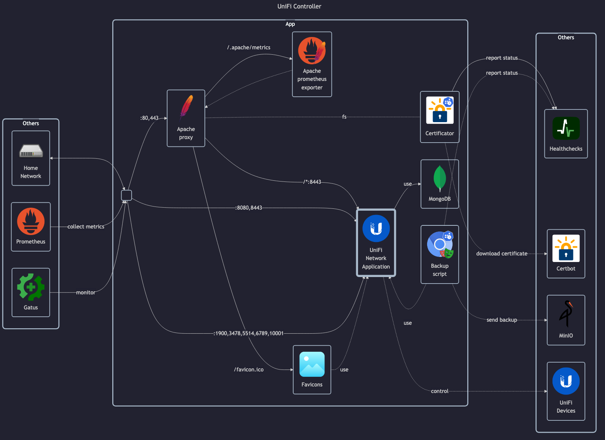

# UniFi Controller



## Docs

UniFi (official):

- Open Ports overview: <https://help.ui.com/hc/en-us/articles/218506997-UniFi-Network-Required-Ports-Reference>

LinuxServer (unofficial):

- LinuxServer docs: <https://docs.linuxserver.io/images/docker-unifi-network-application/>
- LinuxServer GitHub: <https://github.com/linuxserver/docker-unifi-network-application>
- LinuxServer DockerHub: <https://hub.docker.com/r/linuxserver/unifi-network-application>

For compatibility reasons, this app is using MongoDB from <https://github.com/themattman/mongodb-raspberrypi-docker>,
instead of the official version, in order to run it on Raspberry Pi 4B.
This is necessary, because the official version requires `ARMv8.2`, and this Raspberry Pi only has `ARMv8.0`.
This is connected to required AVX extensions, same as the official x64 MongoDB version (which coincidentally also can't run on my Ordroid H3).

## Note for Healtcheck

This is good `/status`:

```json
{
  "meta": {
    "rc": "ok",
    "up": true,
    "server_version": "[REDACTED]",
    "uuid": "[REDACTED]"
  },
  "data": []
}
```

This is bad (still starting) `/status`:

```json
{
  "meta": {
    "rc": "ok",
    "server_version": "[REDACTED]",
    "server_running": false,
    "db_migrating": false,
    "up": false,
    "app_context_status": "[REDACTED]",
    "app_context_message": "[REDACTED]"
  },
  "data": []
}
```

## Before initial installation

- Follow general [guide](../../docs/Checklist%20for%20new%20docker-apps.md)

## After initial installation

- \[All\] Complete initial wizard / restore from backup
    - Setup admin _username_, _password_ and _email_
- \[Prod\] Create extra users: `viewer` and `homepage`
- \[Prod\] Configure basic settings
    - Setup SMTP server address for emails
- \[Prod\] Connect and configure UniFi devices
