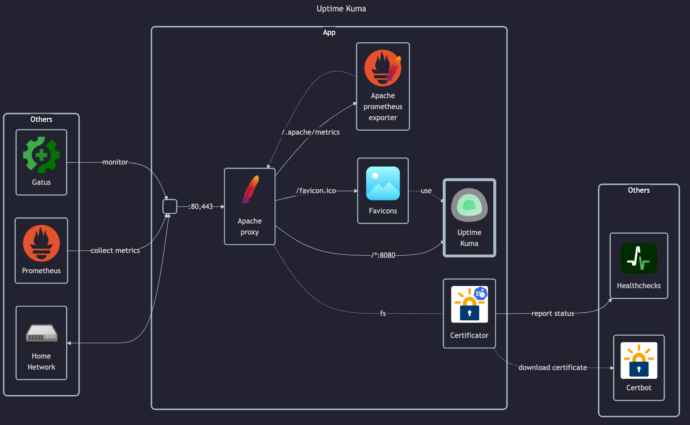

# Uptime Kuma

## Docs

- GitHub: <https://github.com/louislam/uptime-kuma>
- DockerHub: <https://hub.docker.com/r/louislam/uptime-kuma>
- Docs: <https://github.com/louislam/uptime-kuma/wiki>

## Before initial installation

- Follow general [guide](../../docs/Checklist%20for%20new%20docker-apps.md)

## After initial installation

- Setup admin _username_ and _password_
- Setup monitoring
- Settings setup:
    - Setup timezone
    - Setup Primary Base URL
    - Disallow automatic updates
    - Setup notifications (Ntfy, Gotify, SMTP)
    - Modify data persistancy interval
- Setup status page `dashboard`
