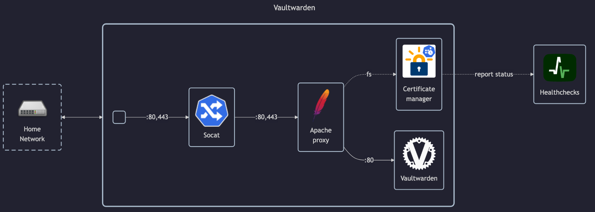

# Vaultwarden

## Docs

- GitHub: <https://github.com/dani-garcia/vaultwarden>
- DockerHub: <https://hub.docker.com/r/vaultwarden/server>
- Install tutorial: `https://community.hetzner.com/tutorials/how-to-set-up-vaultwarden` (Note: frequent network errors)

Bitwarden:

- Docs: <https://bitwarden.com/help>

## Before initial installation

- Follow general [guide](../../docs/Checklist%20for%20new%20docker-apps.md)

## After initial installation

- Create accounts `matej`, `homelab-viewer` and `homelab-test` on `https://vaultwarden.tld/admin`
- Create `Homelab` organization from `matej` user
- Import passwords from JSON/CSV backup
    - Change imported collection from `Default collection` to `Homelab`
- Share `Homelab` organization+collection with `homelab-viewer` (readonly)
- Login personal PC and all servers
