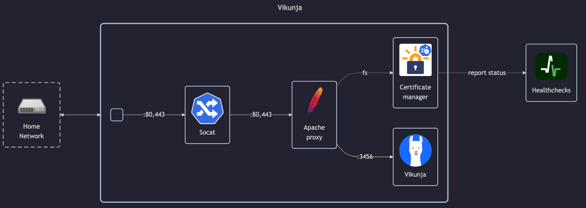

# Vikunja

## Docs

- Docs: <https://vikunja.io/docs>
    - Install guide: <https://vikunja.io/docs/installing>
    - Configuration: <https://vikunja.io/docs/config-options>
- GitHub: <https://github.com/go-vikunja/vikunja>
- DockerHub: <https://hub.docker.com/r/vikunja/vikunja>

## Before initial installation

- Follow general [guide](../../docs/Checklist%20for%20new%20docker-apps.md)

## After initial installation

- Create new user using cli: `docker exec -it vikunja-app ./vikunja user create --email <user>@<domain> --username <user> --password <password>`
