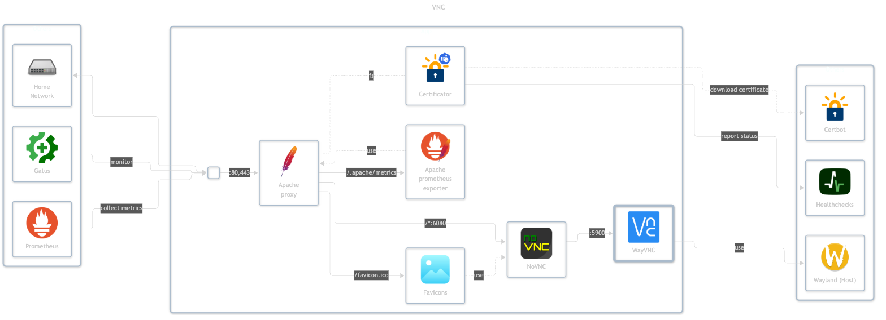

# VNC

## Docs

NoVNC:

- GitHub: <https://github.com/bonigarcia/novnc>

WayVNC:

- GitHub: <https://github.com/any1/wayvnc>

## Services

- `wayvnc` - attaches to the host Wayland session and controls it (private)
- `novnc` - exposes the browser client which connects to wayvnc (public)

## Before initial installation

- Follow general [guide](../../docs/Checklist%20for%20new%20docker-apps.md)

## After initial installation

N/A
